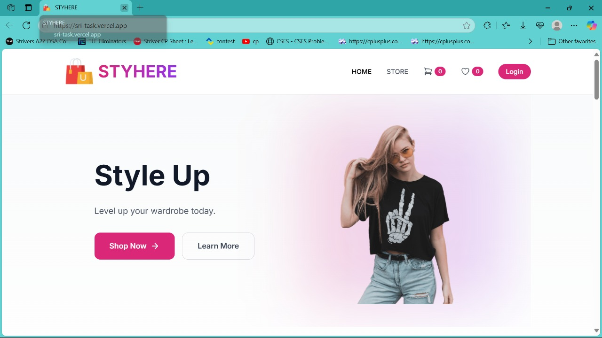
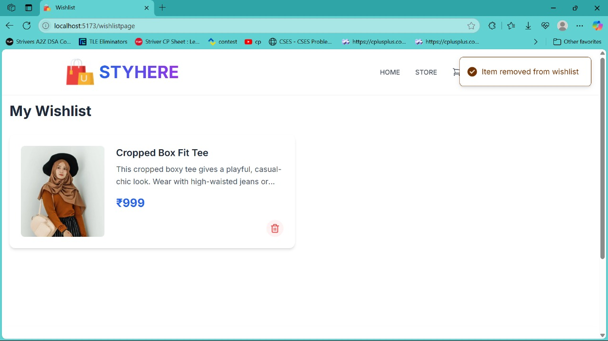

# Sri Task App

A full-stack web application with role-based access for **Admin** and **User** roles.  
Live Demo: [sri-task.vercel.app](https://sri-task.vercel.app/)

## 🚀 Features

- 💼 **Admin Dashboard** with extended access
- 👤 **User Panel** for individual users
- 🧾 Task management functionality (create, update, delete)
- 🔐 Role-based authentication & authorization
- ⚡ Fast and responsive UI using Vite + Tailwind CSS
- 🌍 Deployed on **Vercel**

## 👥 User Roles

### 👤 User
- Can log in and view their dashboard
- Access features permitted to regular users
Email ->uk@gmail.com
Password -> uk1234

### 🛡️ Admin
- Full access to the system
- Can manage tasks and users
- Admin dashboard with extra controls
Email ->admin@gmail.com
Password ->admin1234

## 📁 Project Structure

```
Sri-Task/
│
├── Frontend-master/           # Frontend built with Vite
│   ├── public/                # Static assets
│   ├── src/                   # Main React source code
│   ├── index.html             # HTML template
│   ├── tailwind.config.js     # Tailwind configuration
│   ├── vite.config.js         # Vite configuration
│   ├── vercel.json            # Vercel config for frontend
│
├── server/                    # Backend built with Node.js + Express
│   ├── config/                # DB and env config
│   ├── controllers/           # Route handlers
│   ├── helpers/               # Utility functions
│   ├── middleware/            # Authentication & other middleware
│   ├── models/                # Mongoose models
│   ├── routes/                # Express route definitions
│   ├── server.js              # Main server entry point
│   ├── vercel.json            # Vercel config for backend
│
├── README.md                  # You're reading it!
```

## ⚙️ Setup & Installation

### Prerequisites

- Node.js ≥ 14
- npm or yarn
- MongoDB instance (local or cloud)

### 1. Clone the repository

```bash
git clone https://github.com/your-username/sri-task.git
cd sri-task
```

### 2. Setup Backend

```bash
cd server
npm install
cp .env.example .env   # Add MongoDB URI and other env variables
npm run dev
```

### 3. Setup Frontend

```bash
cd ../Frontend-master
npm install
npm run dev
```

The frontend should now be running at `http://localhost:5173`  
The backend API should be running at `http://localhost:5000`

## 📝 API Endpoints

POST /api/auth/register – Register new user

POST /api/auth/login – Login existing user

POST /api/auth/forgot-password – Change password (requires login)

GET /api/auth/user-auth – Check if user is authenticated

GET /api/auth/admin-auth – Check if admin is authenticated

PUT /api/auth/update-profile – Update user profile (requires login)

GET /api/auth/getorders – Get current user's orders

GET /api/auth/all-orders – Get all orders (admin only)

PUT /api/auth/order-status/:orderId – Update order status (admin only)

GET /api/auth/users – Get all users (admin only)

GET /api/auth/user-stats – Get user statistics (admin only)

GET /api/auth/dashboard-stats – Get dashboard analytics (admin only)

## 🌐 Deployment

Both the frontend and backend are deployed using **Vercel**.  
Ensure your `vercel.json` in both directories is correctly configured for routing and build.

## 📄 License

MIT License

## 🤝 Contributing

Pull requests are welcome. For major changes, please open an issue first to discuss what you would like to change.

---


## Screenshots







